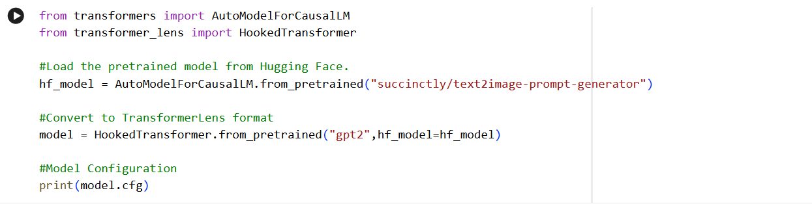
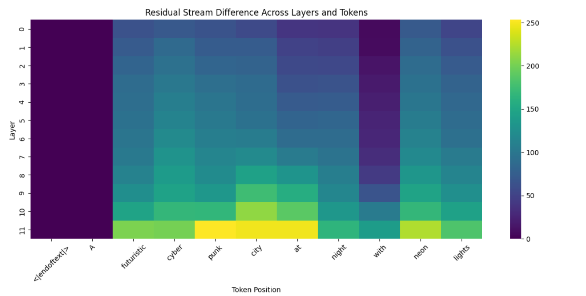
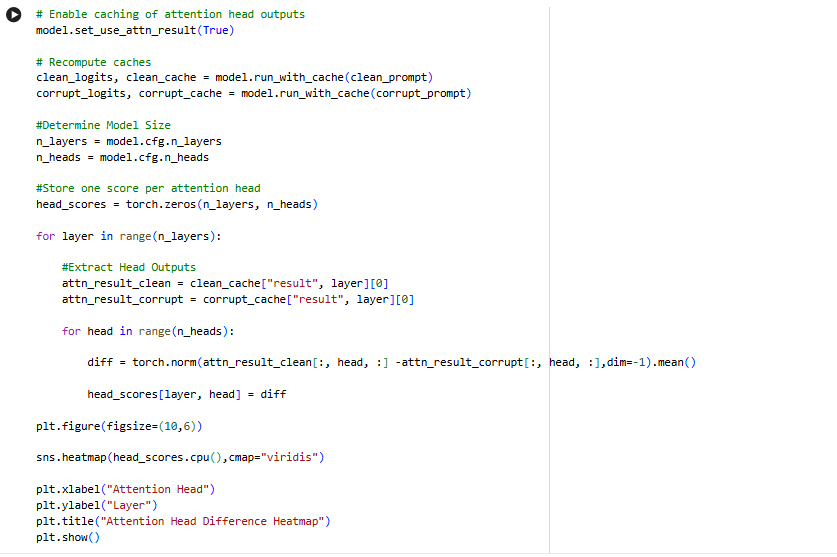
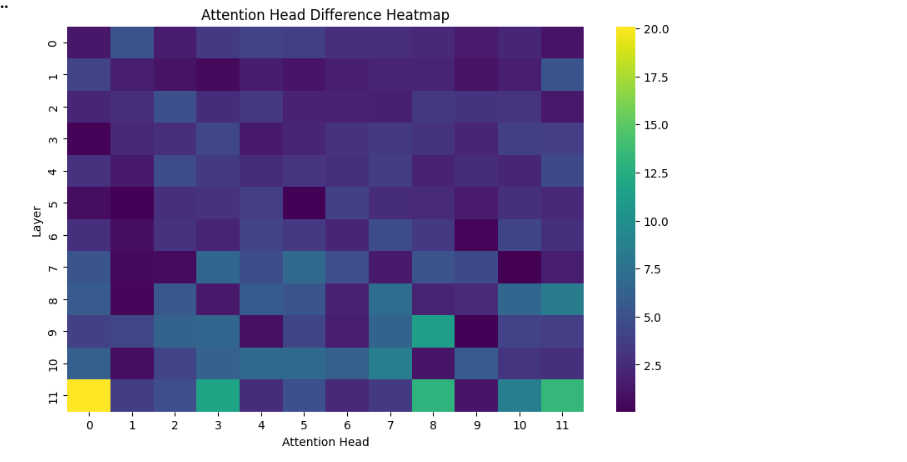
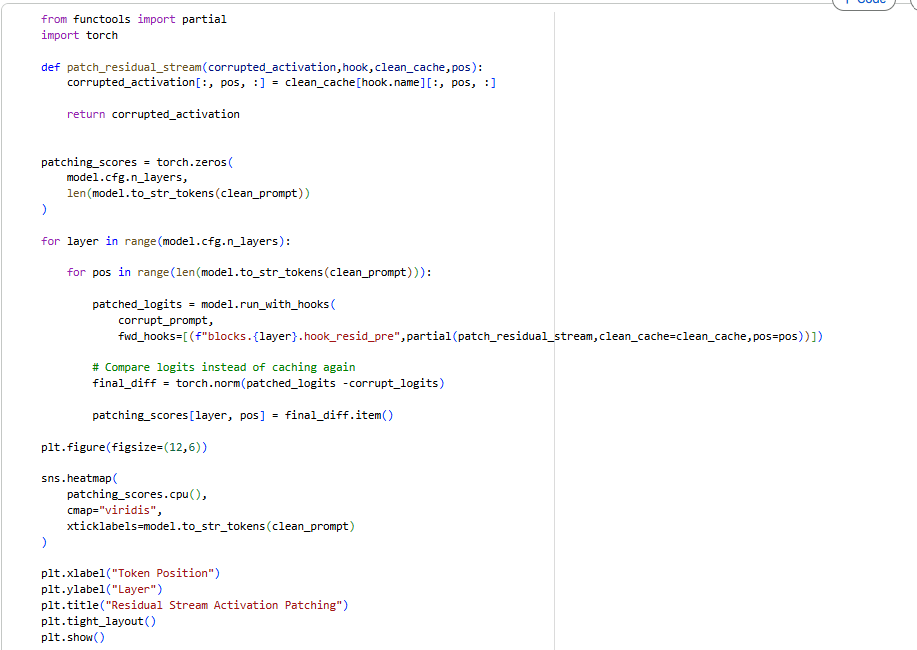
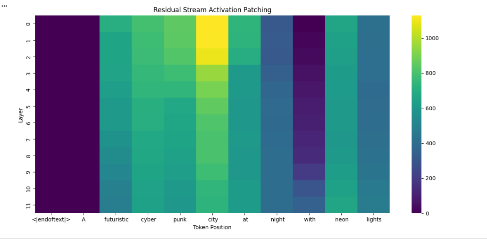

# Inside a Text-to-Image Prompt Generator with Transformer Lens

Introduction
Text to image generators rely heavily on prompts which makes Text-to-Image prompt generators indispensable for the fascinating outputs they produce. In this blog post, we will like to deep dive into the working and mechanisms of prompt generators deployed in Text to image generators. One such prompt generator is the “succinctly/text2image-prompt-generator” which we shall be using for our study here.

Goal
The “succinctly/text2image-prompt-generator” is built on GPT-2 and therefore can be analysed using tools from transformer lens.

We seek to answer the following questions here:
1)	Which layers respond most strongly to changes in visual concepts?
2)	Which tokens carry the most visual information?
3)	Which attention heads are involved in processing scene descriptors?
4)	Where is visual metadata represented in the residual stream?

To investigate this we compare two prompts which we call clean_prompt and corrupt_prompt. 

Clean_prompt:
"A futuristic cyberpunk city at night with neon lights"

Corrupt_prompt:
"A medieval fantasy village during the day with wooden houses"

These prompts differ significantly in style, environment, and lighting, making them ideal for studying internal representations.

# Model Setup

 
The Hugging Face model was first loaded and then converted into a TransformerLens HookedTransformer model so that internal activations can be accessed.  We found that, the succinctly/text2image-prompt-generator model is based on the GPT-2 architecture and contains 12 transformer layers, 12 attention heads, a hidden dimension of 768, and an MLP dimension of 3072, with a context length of 1024 tokens. It also has a vocabulary size of 50,257 tokens.

Residual Stream Analysis
In our first experiment, we compared the residual stream analysis of the two prompts across all the transformer layer.
 
In the plot generated, we analyzed that the model gradually builds the distinct representation of the two visual scenes. The peaks observed in the later layers show the layers in which the high level visual attributes of the scene become strongly encoded. 

The analysis of the plot is as follows:
o	Early layers (0–4) show modest separation between the two prompts.
o	Middle layers (5–8) gradually amplify the difference.
o	Late layers (9–11) show a sharp increase in residual divergence.
o	Layer 11 has the largest difference, suggesting that scene-level visual concepts are consolidated near the end of the network.

# Token Level Analysis
Next we compared the residual representations at individual token positions. 
 

We noticed that the difference between the clean and corrupt prompts increased gradually across the transformer layers. Tokens that correspond to the scene defining attributes such as “cyber”, “punk”, “city” and “neon” exhibited the highest activation differences indicating that these tokens play a major role in encoding the visual metadata.

# Attention Head Analysis
 

To determine which attention heads were most sensitive to visual scene changes, we compared the outputs of corresponding attention heads for two prompts. 
The heatmap obtained shows that most significant activity is concentrated in the final layers of the transformer layer(Layer 11), particularly in the heads 0,3 ,8 and 11. These exhibit large activation differences when compared to the rest of the network. 
The concentration of activity in Layer 11 aligns with earlier residual-stream analyses, which shows that the largest representational differences between the clean and corrupt prompts emerge in the final layers. Together, these findings indicate that visual metadata is consolidated late in the network and routed through a small set of highly responsive attention heads.

# Activation Patching
Residual stream activation patching was performed by replacing individual residual activations from the clean prompt into the corrupt prompt and measuring the resulting change in the model's output representation. The resulting heatmap identifies token-layer pairs that are causally important for encoding visual scene information. The strongest effects were observed for the tokens "city", "cyber", "punk", and "neon", indicating that these descriptors play a central role in shaping the model's internal visual representation. In contrast, generic tokens such as "A" and "<|endoftext|>" produced negligible effects, demonstrating that visual metadata is concentrated in semantically meaningful scene descriptors.

 

 

Conclusion
The analysis revealed several interesting patterns inside the text-to-image prompt generator:
1.	Visual information becomes increasingly separated in the later transformer layers.
2.	Scene-defining descriptors such as cyber, punk, city, and neon dominate the internal representation.
3.	A small number of late-layer attention heads are responsible for much of the visual processing.
4.	Activation patching demonstrates that these representations are causally important for the model's behaviour.
5.	Visual metadata is concentrated in specific residual stream directions before generation.
Overall, the results suggest that the model builds visual scene representations progressively, integrates them through specialized attention heads, and consolidates them into structured residual stream features before generating the final prompt continuation.

